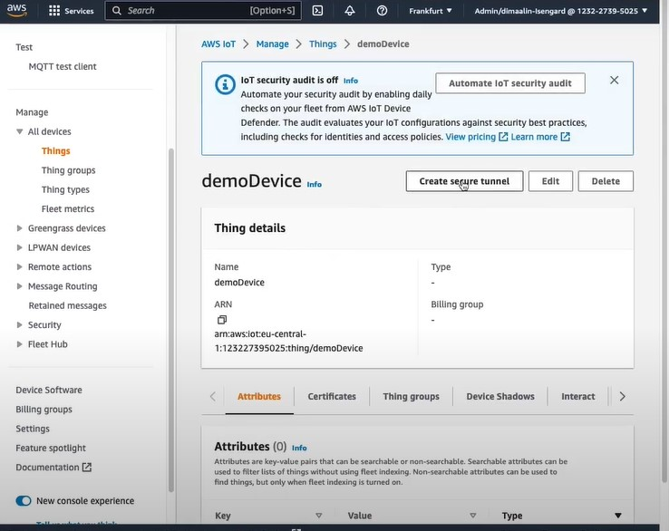
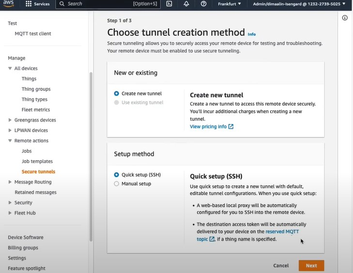
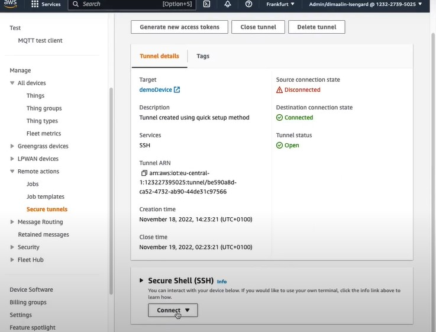
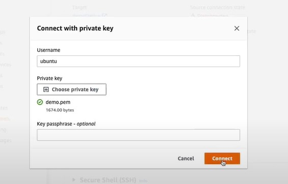
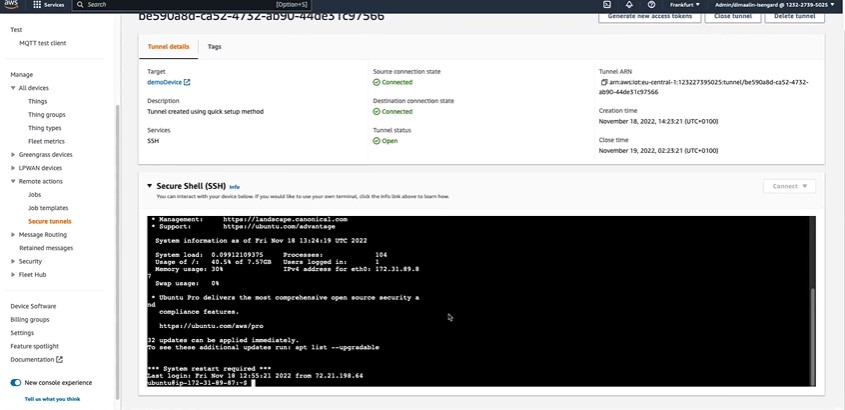

# Connect a Remote IoT Device using Secure Tunneling
[](http://www.youtube.com/watch?v=bRIsuWlzcgs "Video Title")

*For a simplified fully build method for arm64 go to [Simplified-AWS-Secure-Tunneling](./docs/simplified_aws_iotIsecure_tunneling.md)*

## Prerequisites
* AWS IoT Thing created, and the certificate, private key and root CA on the device.
* AWS IoT Device Client is built on the device([instructions](./docs/AWS_IoT_device_client.md)).

## Credentials
* AWS IoT endpoint 
* Path to public PEM certificate
* Path to the private key
* Path to the ROOT CA certificate
* Thing name

## Device Configuration
* Go into `aws-iot-device-client` folder:
  ```BASH
  cd ~
  cd projects/aws-iot-device-client
  ```
* Create a folder `/identity` and change permission.
  ```BASH
  mkdir indentity
  sudo chmod 700 ./identity
  ```
* Place inside the folder `identity` the credentials: 
  - PEM certificate(`*.pem.crt`).
  - Private key(`*.pem.key`). 
  - ROOT CA certificate(`*.pem`).
* Change the permissions on each certificate as follow
  ```BASH
  sudo chmod 644 /identity/certificate.pem.crt
  sudo chmod 600 /identity/private.pem.key
  sudo chmod 644 /identity/ROOT_CA1.pem
  ```
* Execute the setup file and provide the credentials as needed.  
  ```BASH
  # Setup
  sudo ./setup.sh 
  ```
  At this point you'll need to respond to prompts for information as follow, including paths to your thing certs.
  ```BASH
  WARNING: Only run this setup script as root if you plan to run the AWS IoT Device Client as root,  or if you plan to run the AWS IoT Device Client as a service. Otherwise, you should run this script as  the user that will execute the client.
  Do you want to interactively generate a configuration file for the AWS IoT Device Client? y/n
  y #write y
  Specify AWS IoT endpoint to use:
    #enter endpoint
  a35lkm5jyds64h-ats.iot.us-east-1.amazonaws.com 
  Specify path to public PEM certificate:
    #enter PEM certificate full address
  Specify path to private key:
    #enter private key full address
  Specify path to ROOT CA certificate:
    #enter ROOT CA 1 certificate full address
  Specify thing name (Also used as Client ID):
    #enter thing name
  Would you like to configure the logger? y/n
  y #write y
  Specify desired log level: DEBUG/INFO/WARN/ERROR
    #press Enter
  Specify log type: STDOUT for standard output, FILE for file
  FILE #write FILE
  Specify path to desired log file (if no path is provided, will default to /var/log/aws-iot-device-client/aws-iot-device-client.log:
    #press enter
  Creating default log directory...
  Would you like to configure the SDK logging? y/n
  y #write yes
  Specify desired SDK log level: TRACE/DEBUG/INFO/WARN/ERROR/FATAL
    #press enter
  Specify path to desired SDK log file (if no path is provided, will default to /var/log/aws-iot-device-client/sdk.log:
    #press enter
  Creating default SDK log directory...
  Enable Jobs feature? y/n
  n #write n
  Enable Secure Tunneling feature? y/n
  y #write y
  Enable Device Defender feature? y/n
  n #write n
  Enable Fleet Provisioning feature? y/n
  n #write n
  Enable Pub Sub sample feature? y/n
  n #write n
  Enable Config Shadow feature? y/n
  n #write n
  Enable Sample Shadow feature? y/n
  n #write n

      {
        "endpoint":	"**********.iot.us-east-1.amazonaws.com",
        "cert":	"/home/nviidia/Projects/aws-iot-device-client/identity/certificate.pem.crt",
        "key":	"/home/nviidia/Projects/aws-iot-device-client/identity/private.pem.key",
        "root-ca":	"/home/nviidia/Projects/aws-iot-device-client/identity/CA1.pem",
        "thing-name":	"THING_name",
        "logging":	{
          "level":	"",
          "type":	"FILE",
          "file": "/var/log/aws-iot-device-client/aws-iot-device-client.log",
          "enable-sdk-logging":	true,
          "sdk-log-level":	"",
          "sdk-log-file": "/var/log/aws-iot-device-client/sdk.log"
        },
        "jobs":	{
          "enabled":	false,
          "handler-directory": "/etc/.aws-iot-device-client/jobs"
        },
        "tunneling":	{
          "enabled":	true
        },
        "device-defender":	{
          "enabled":	false,
          "interval": 300
        },
        "fleet-provisioning":	{
          "enabled":	false,
          "template-name": "",
          "template-parameters": "",
          "csr-file": "",
          "device-key": ""
        },
        "samples": {
          "pub-sub": {
            "enabled": false,
            "publish-topic": "",
            "publish-file": "/etc/.aws-iot-device-client/pubsub/publish-file.txt",
            "subscribe-topic": "",
            "subscribe-file": "/etc/.aws-iot-device-client/pubsub/subscribe-file.txt"
          }
        },
        "config-shadow":	{
          "enabled":	false
        },
        "sample-shadow": {
          "enabled": false,
          "shadow-name": "",
          "shadow-input-file": "",
          "shadow-output-file": ""
        }
      }
  Does the following configuration appear correct? If yes, configuration will be written to /etc/.aws-iot-device-client/aws-iot-device-client.conf: y/n
  y #write y
  Configuration has been successfully written to /etc/.aws-iot-device-client/aws-iot-device-client.conf
  Creating default pubsub directory...
  Do you want to copy the sample job handlers to the specified handler directory (/etc/.aws-iot-device-client/jobs)? y/n
  y #write y
  Do you want to install AWS IoT Device Client as a service? y/n
  y #write y
  Enter the complete directory path for the aws-iot-device-client. (Empty for default: ./build/aws-iot-device-client)
    #press enter
  Enter the complete directory path for the aws-iot-device-client service file. (Empty for default: ./setup/aws-iot-device-client.service)
    #press enter
  Do you want to run the AWS IoT Device Client service via Valgrind for debugging? y/n
  n #write n
  Installing AWS IoT Device Client...
  /bin/systemctl
  ● aws-iot-device-client.service - AWS IoT Device Client
    Loaded: loaded (/etc/systemd/system/aws-iot-device-client.service; enabled; vendor preset: enabled)
    Active: active (running) since Sat 2023-05-13 17:32:17 -03; 42ms ago
  Main PID: 26641 (aws-iot-device-)
      Tasks: 2 (limit: 4172)
    CGroup: /system.slice/aws-iot-device-client.service
            └─26641 /sbin/aws-iot-device-client --config-file /etc/.aws-iot-device-client/aws-iot-device-client.conf

  mai 13 17:32:17 jetson-nano systemd[1]: Started AWS IoT Device Client.
  ```

* Check if the service is running
  ```BASH
  sudo service aws-iot-device-client status   
  ```
* Restart the service
  ```BASH
  sudo service aws-iot-device-client restart   
  ```
* Check the logs
  ```BASH
  sudo less /var/log/aws-iot-device-client/aws-iot-device-client.log  
  ```

## AWS configuration
* Create the tunnel  
    
  Select *Create new tunnel* and *Quick setup(SSH)*  
    
  Once tunnel is created, isn't needed to store the tokens. It's going to be sent through MQTT message.
* Connect through SSH  
  On Secure Shell(SSH) select *Connect* then *Use private key*.  
    
  Upload the private key and connect.  
    
  Device Successfully connected!  
    
