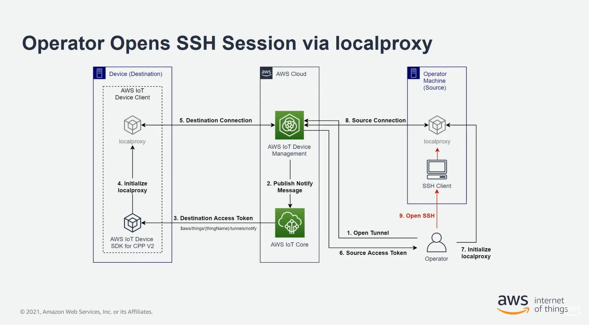

# AWS IoT secure tunneling
Secure tunneling is used to establish bidirectional communication to remote devices over a secure connection that is managed by AWS IoT. Secure tunneling does not require updates to your existing inbound firewall rules. 

[Reference](https://docs.aws.amazon.com/iot/latest/developerguide/secure-tunneling.html)

## What is secure tunneling?
Use secure tunneling to access devices that are deployed behind port-restricted firewalls at remote sites. You can connect to the destination device from your laptop or desktop computer as the source device by using the AWS Cloud. The source and destination communicate by using an *open source local proxy* that runs on each device.  

The local proxy communicates with the AWS Cloud by using an open port that is allowed by firewall, typically `443`. Data that is transmitted through the tunnel is encrypted using Transported Layer Security (TLS).

## Secure tunneling concepts
Information about how secure tunneling works, see How secure tunneling works.

### Client access token (CAT)
A pair of tokens *generated by secure tunneling* when a new tunnel is created. The CAT is used by the source and destination devices to connect to the secure tunneling service. The *CAT can only be used once to connect to the tunnel*. To reconnect to the tunnel, rotate the client access tokens using the RotateTunnelAccessToken API operation or the rotate-tunnel-access-token CLI command.

### Client token
A unique value *generated by the client* that AWS IoT secure tunneling can use for all subsequent retry connections to the same tunnel. This field is **optional**. If the client token is not provided, then the client access token *(CAT) can only be used once* for the same tunnel. Subsequent connection attempts using the same CAT will be rejected. [Reference](https://github.com/aws-samples/aws-iot-securetunneling-localproxy/blob/main/V2WebSocketProtocolGuide.md)

### Destination application
The application that runs on the destination device.

### Destination device
The remote device you want to access.

### Device agent
An IoT application that connects to the AWS IoT device gateway and listens for new tunnel notifications over MQTT. [More information](https://docs.aws.amazon.com/iot/latest/developerguide/configure-remote-device.html#agent-snippet)

### Local proxy
A software proxy that *runs on the source and destination devices* and relays a data stream between secure tunneling and the device application. The local proxy can be run in source mode or destination mode. [More information](https://docs.aws.amazon.com/iot/latest/developerguide/local-proxy.html)

### Source device
The device an operator uses to initiate a session to the destination device, usually a laptop or desktop computer.

### Tunnel
A logical pathway through AWS IoT that enables bidirectional communication between a source device and destination device.

## How secure tunneling works
How secure tunneling establishes a connection between your source and destination device.  
1. Open a tunnel
To open a tunnel for initiating a session with your remote destination device, you can use the AWS Management Console, the [AWS CLI open-tunnel](https://docs.aws.amazon.com/cli/latest/reference/iotsecuretunneling/open-tunnel.html) command, or the [OpenTunnel API](https://docs.aws.amazon.com/iot/latest/apireference/API_iot-secure-tunneling_OpenTunnel).

2. Download the client access token pair
After you've opened a tunnel, you can *download the client access token (CAT) for your source and destination* and save it on your source device. You must retrieve the CAT and save it now before starting the local proxy.

3. Start local proxy in destination mode
The IoT agent that has been installed and is running on *your destination device will be subscribed to the reserved MQTT topic* `$aws/things/thing-name/tunnels/notify` and will receive the CAT. Here, thing-name is the name of the AWS IoT thing you create for your destination. [More information](https://docs.aws.amazon.com/iot/latest/developerguide/reserved-topics.html#reserved-topics-secure).  
The IoT agent then uses the CAT to start the local proxy in destination mode and set up a connection on the destination side of the tunnel. [More information.](https://docs.aws.amazon.com/iot/latest/developerguide/configure-remote-device.html#agent-snippet)

4. Start local proxy in source mode
After the tunnel has been opened, *AWS IoT Device Management provides the CAT for the source* that you can download on the source device. You can *use the CAT to start the local proxy* in source mode, which then connects the source side of the tunnel. [More information.](https://docs.aws.amazon.com/iot/latest/developerguide/local-proxy.html)

5. Open an SSH session
As both sides of the tunnel are connected, you can *start an SSH session by using the local proxy* on the source side.  

[For more information about the process.](https://docs.aws.amazon.com/iot/latest/developerguide/secure-tunneling-tutorial-open-tunnel.html) 

The following video describes how secure tunneling works and walks you through the process of setting up an SSH session to a Raspberry Pi device.  

## Secure tunnel lifecycle
Tunnels can have the status OPEN or CLOSED. Connections to the tunnel can have the status CONNECTED or DISCONNECTED. The following shows how the different tunnel and connection statuses work.

1. When you open a tunnel, it has a status of OPEN. The tunnel's source and destination connection status is set to DISCONNECTED.

2. When a device (source or destination) connects to the tunnel, the corresponding connection status changes to CONNECTED.

3. When a device disconnects from the tunnel while the tunnel status remains OPEN, the corresponding connection status changes back to DISCONNECTED. A device can connect to and disconnect from a tunnel repeatedly as long as the tunnel remains OPEN.

4. When you call `CloseTunnel` or the tunnel remains OPEN for longer than the `MaxLifetimeTimeout` value, a tunnel's status becomes CLOSED. You can configure `MaxLifetimeTimeout` when calling OpenTunnel. `MaxLifetimeTimeout` defaults to 12 hours if you do not specify a value.  
*Note: A tunnel cannot be reopened when it is CLOSED.*

5. You can call `DescribeTunnel` and `ListTunnels` to view tunnel metadata while the tunnel is visible. The tunnel can be visible in the AWS IoT console for at least three hours before it is deleted.

## Tutorials
This section focus on creating a tunnel using the AWS Management Console and the AWS IoT API Reference. In the AWS IoT console, you can create a tunnel from the [Tunnels hub](https://console.aws.amazon.com/iot/home#/tunnels) page or from the details page of a thing that you created.

- [Open a tunnel and use browser-based SSH to access remote device](./open_tunnel_method_1.md)  
This tutorial shows how to open a tunnel from the [Tunnels hub](https://console.aws.amazon.com/iot/home#/tunnels) page using the quick setup method. You'll also learn how to use browser-based SSH to access the remote device using an in-context CLI within the AWS IoT console.
- [Open a tunnel using manual setup and connect to remote device](./open_tunnel_method_2.md)  
This tutorial shows how to open a tunnel from the Tunnels hub page using the manual setup method. You'll also learn how to *configure and start the local proxy* from a terminal in your source device and connect to the tunnel.

- [Open a tunnel for remote device and use browser-based SSH](./open_tunnel_method_3.md)  
This tutorial shows how to open a tunnel from the details page of a thing that you created. You'll learn how to create a new tunnel and use an existing tunnel. The existing tunnel corresponds to the most recent, open tunnel that was created for the device. You can also use the browser-based SSH to access the remote device.